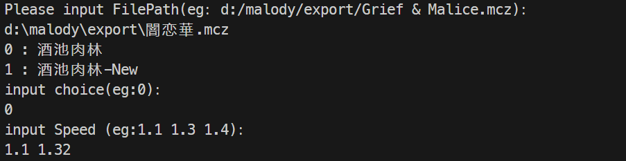
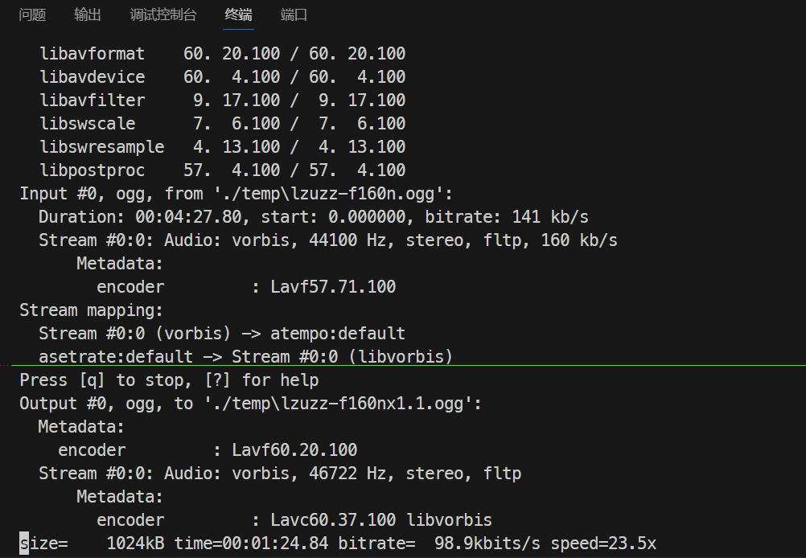
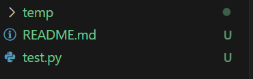
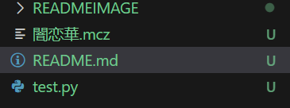
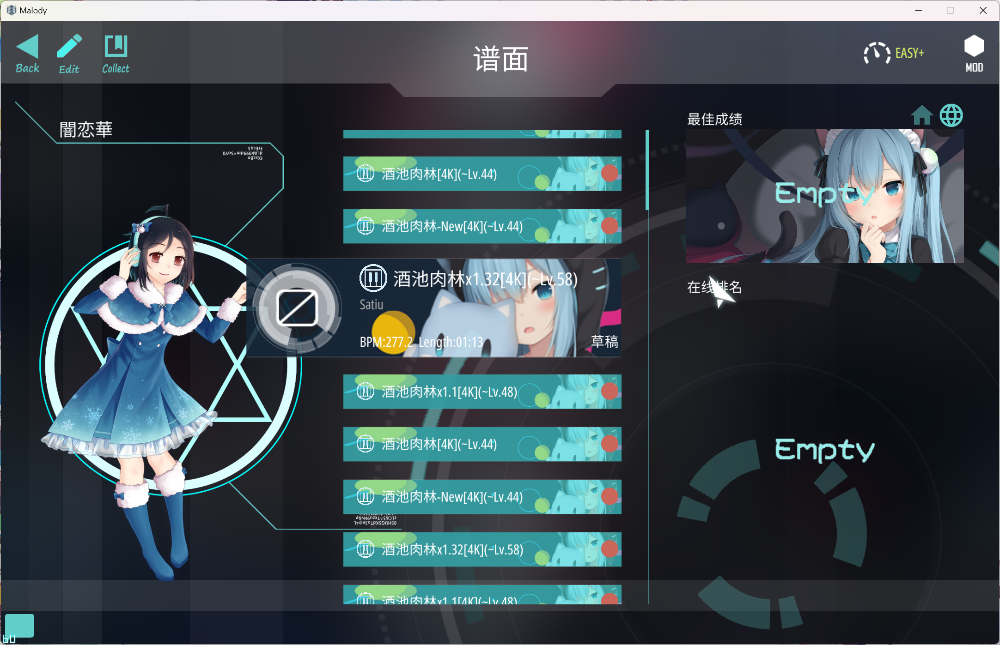

# A Simple Malody BeatMap SpeedChanger

simplely use ffmpeg&&json to edit

# Contens

- [A Simple Malody BeatMap SpeedChanger](#a-simple-malody-beatmap-speedchanger)
- [Contens](#contens)
  - [ScreenShots](#screenshots)
  - [Tips](#tips)

## ScreenShots

- 在终端中运行,每次可自由多倍速
  
- 简单调用 ffmpeg
  
- 会暂时创建 temp 目录并解包到此目录，最后生成 mcz 文件后删除

  
  

- 最后导入到 malody 就行啦ヾ(≧▽≦\*)o
  

## Tips

- 每加速 0.05x 会升高一个半音，减速不会改变音调
- 因为只是复习累了所以随便写的，所以异常处理全都没写
- bug 懒得测了，随便吧
