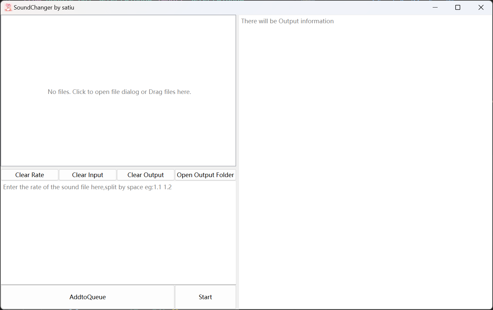
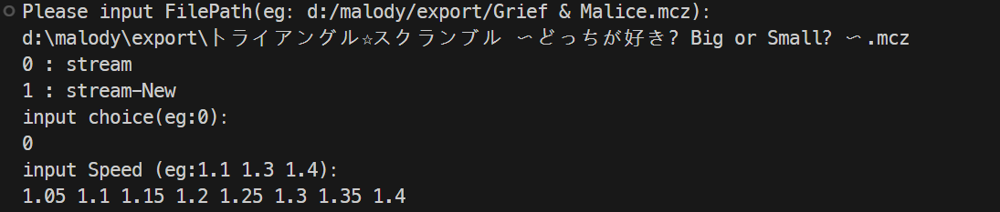
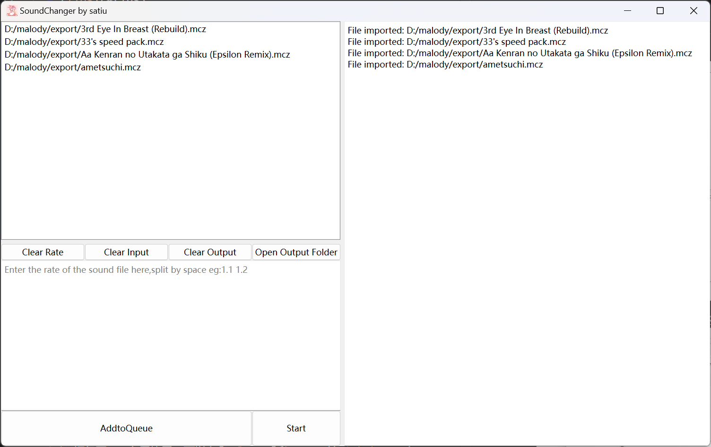
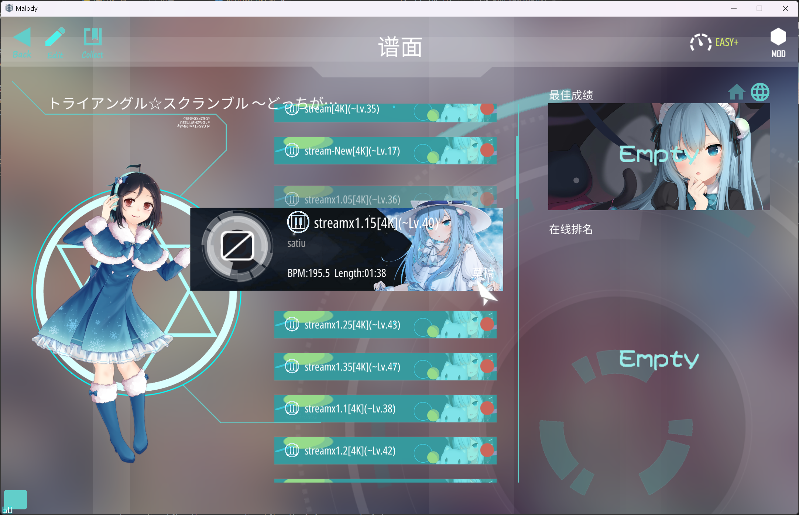
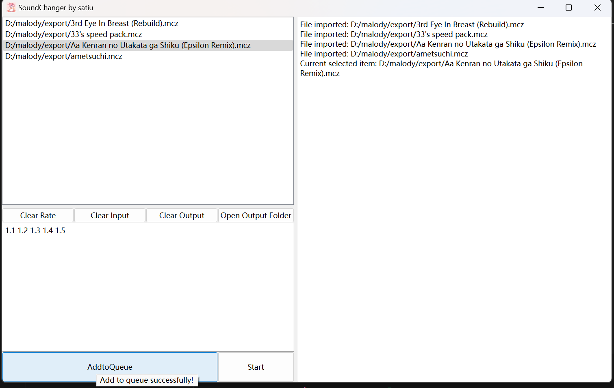
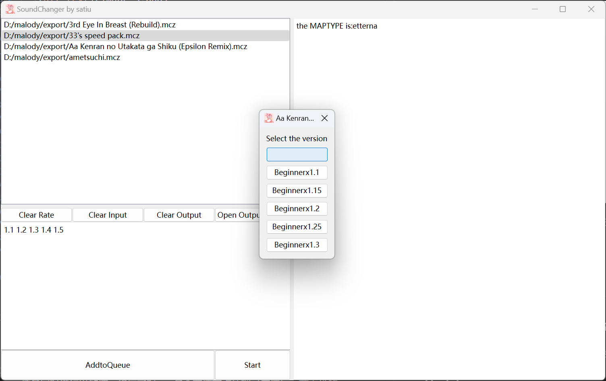
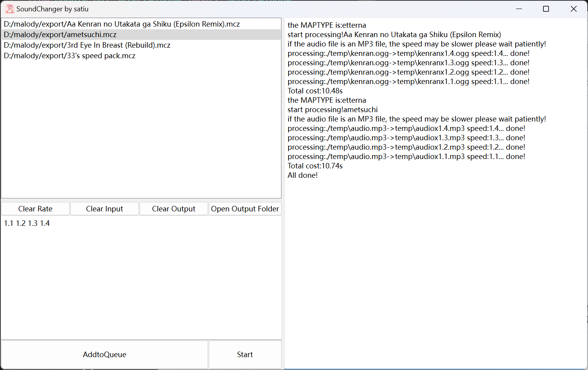
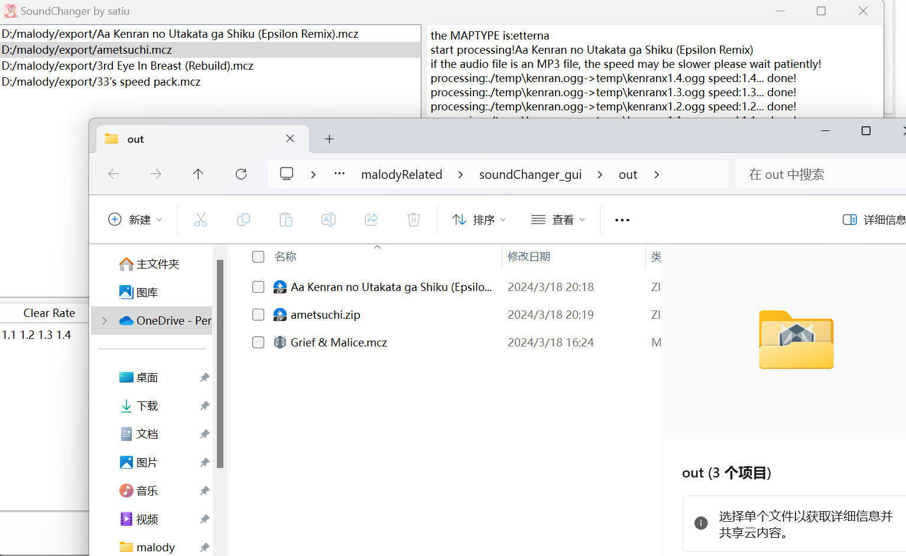

# A Simple BeatMap SpeedChanger

- simplely use sox,ffmpeg,json to edit
- support malody/osu/etterna mania(just tested mania 4k)

# Contens

- [A Simple BeatMap SpeedChanger](#a-simple-beatmap-speedchanger)
- [Contens](#contens)
  - [ScreenShots\&Usage](#screenshotsusage)
  - [Tips](#tips)
  - [Update](#update)

## ScreenShots&Usage
- 这是主界面
  
- 你可以将谱面文件拖入或者点击左上角的板块打开一个文件选择器导入
  
  
- 通过鼠标选择需要操作的item，选择后可以使用上下方向键选择，可以通过Backspace键删除一个item
  
- 在左下角文本框输入倍速(float)，以空格(" ")分隔，点击"AddtoQueue"按钮添加到队列
  
- 将所有任务都添加到队列后点击"Start"按钮开始处理（处理同时也可以为队列添加内容），每张图如果有多个难度名（单个会自动选择）会弹出一个窗口来选择（空难度名也是可以的，但是如果有多个空难度名就不行了，没有区分）
  
- 进行处理
  
- 点击"Open Output Folder"按钮打开项目下的"out"目录
  
- 最后导入到 malody/osu 就行啦ヾ(≧▽≦\*)o

## Tips
- 请不要关闭难度选择窗口（这一块的逻辑还没弄好，可能会导致整个程序出现错误
## Update
- 2024/3/18 initial build
- 2024/3/18 现在queue里的内容将不会重复，同一谱面以最后的输入为主，如果只有一个难度名会跳过选择直接使用