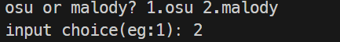

# A Simple BeatMap SpeedChanger

- simplely use sox,ffmpeg,json to edit
- support malody/osu/etterna mania(just tested mania 4k)

# Contens

- [A Simple BeatMap SpeedChanger](#a-simple-beatmap-speedchanger)
- [Contens](#contens)
  - [ScreenShots](#screenshots)
  - [Tips](#tips)
  - [Update](#update)

## ScreenShots
- 在终端中运行,每次可自由多倍速，先选择谱面格式
  
  
  
- 简单调用 sox实现变速
  
- 会暂时创建 temp 目录并解包到此目录，最后生成 mcz 文件后删除

  

- 最后导入到 malody/osu 就行啦ヾ(≧▽≦\*)o
  
  

## Tips
- 加速会升高音调，减速不会改变音调
- 因为只是复习累了所以随便写的，所以异常处理全都没写
- bug 懒得测了，随便吧
- 以后有可能会支持更多格式的谱面(?咕咕咕)
## Update

- 2024/1/31:使用sox替代了ffmpeg实现变速，之前变调有问题
- 2024/2/3:因为sox默认不支持mp3，所以使用ffmpeg转码，增加了对.osu谱面的支持，下一步应该是etterna🤤
- 2024/2/17:调用Tool目录下的ffmpeg和sox，无需额外安装。使用nuitka打包了exe方便使用，可以在[release](https://github.com/satiu123/MalodyBeatmapSpeedChanger/releases)中下载使用
- 2024/2/20:为sox增加了libmad和libmp3lame插件，现在已经不需要ffmpeg了，增加了etterna谱面（.sm）的支持，现在DisplayBpm还没处理，有些有此tag的谱面会在游戏里会有点显示的问题，但是不影响游玩(后面会处理，图片懒得换了,后面会整个gui，方便批量处理)。